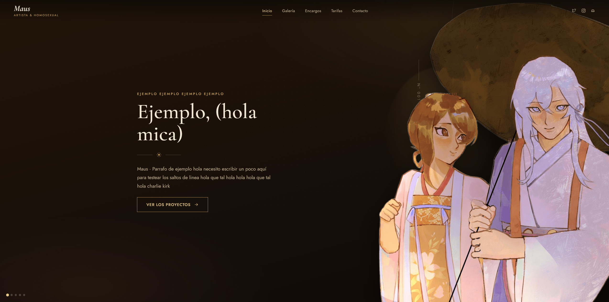
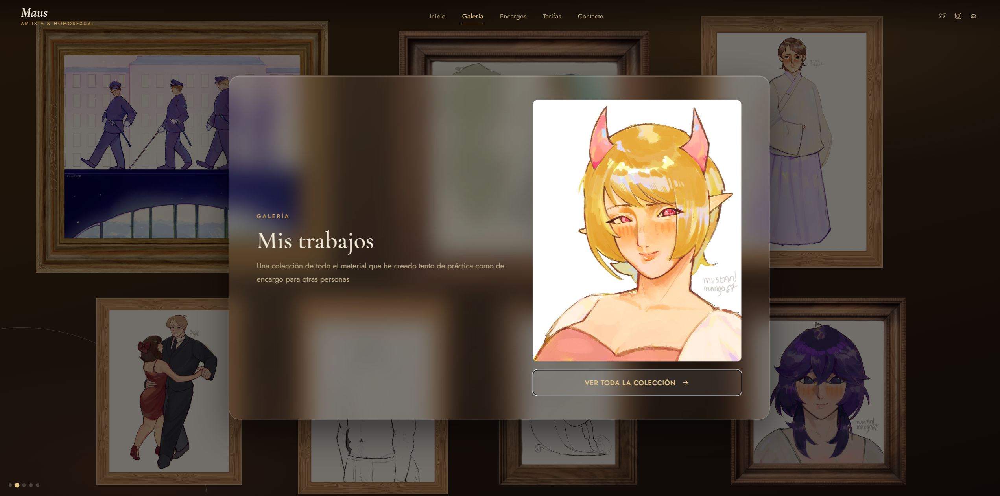
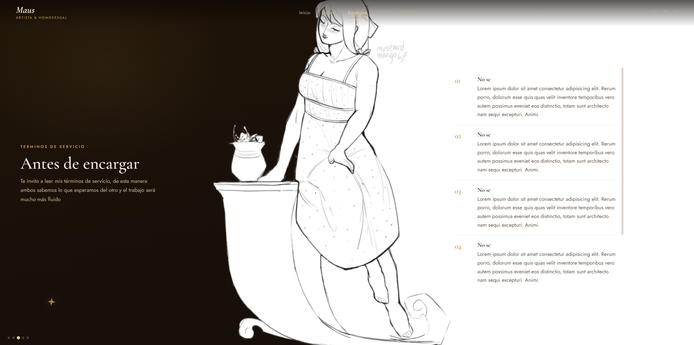

<h1 align="center">Portafolios artístico</h1>

Un portafolios dedicado para un amigo artista.

<h2>📌 Descripción del proyecto</h2>

Un portafolios dedicado para promocionar el servicio de comisiones de un amigo artista, implementando sus bocetos y su arte directamente en la página con una navegación interactiva.

La página no está terminada a la espera de recibir material necesario para implementar dentro de la página, por lo que hasta ahora es únicamente un boceto.

---

<h2>🛠️ Características principales</h2>

<ul>
  <li>HTML, CSS y JavaScript</li>
  <li>Diseño artístico y profesional</li>
  <li>Navegación a modo de diapositiva</li>
</ul>

---

<h2>🖥️ Capturas de la aplicación</h2>

<h3>Landing page</h3>

<h3>Galería</h3>

<h3>Términos de servicio</h3>

---

<h2>🚀 Tecnologías utilizadas</h2>

<ul>
  <li>HTML</li>
  <li>CSS</li>
  <li>JavaScript</li>
</ul>
